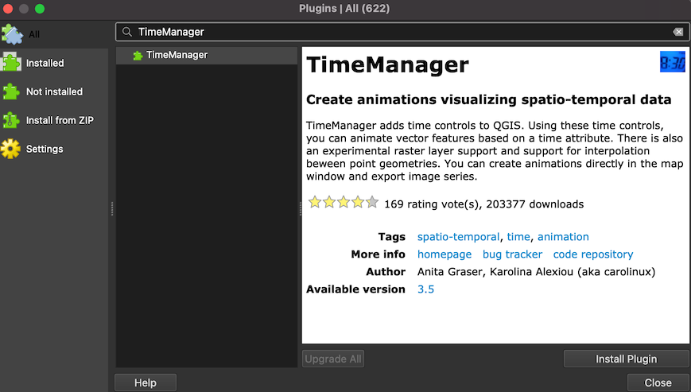
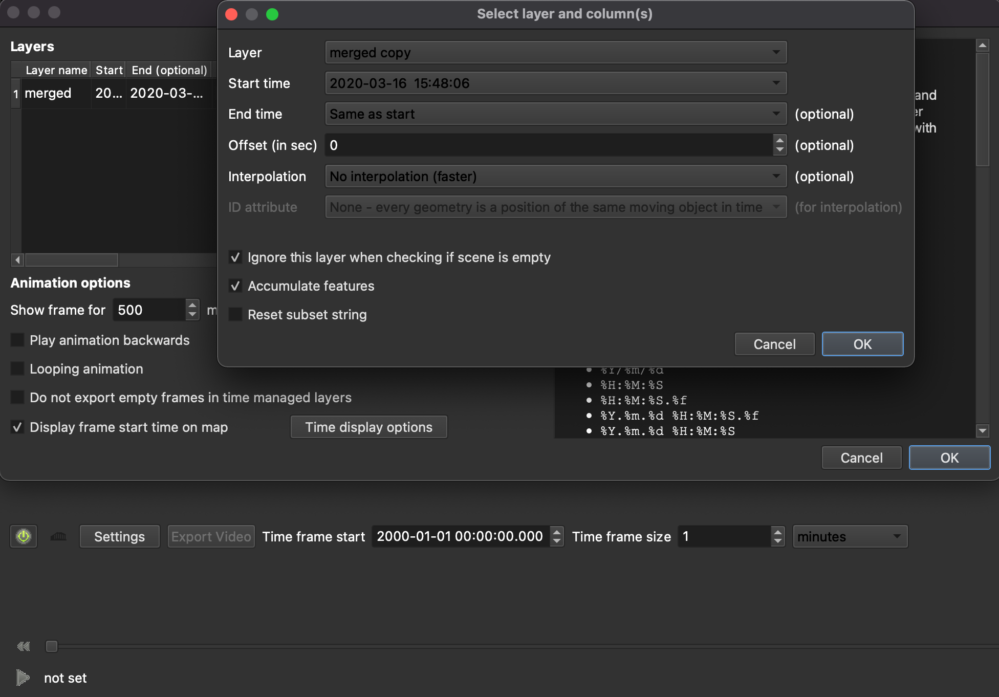
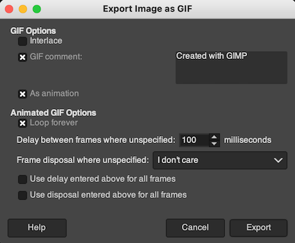

# gpx2gif
Guidelines and tools to convert gpx data into routes animations


### Description
Below you can find information and tools how to convert your gpx data into routes animation, but wait where can I get gpx files?

[GPX](https://en.wikipedia.org/wiki/GPS_Exchange_Format) is fairly common in tracing apps like Strava, Endomono or Garmin and so on.
For now tutorials are only for Garmin, but you should find a lot of tutorial how to export your actives into gpx files.

Sadly whole procedure would be a bit harder on Windows machine ;(

# Inspiration
<blockquote class="reddit-card" data-card-created="1609448560"><a href="https://www.reddit.com/r/MapPorn/comments/f85vqv/this_is_how_londons_street_grid_reveals_using/">This is how London's street grid reveals using only my cycling journeys over the last 5 years.</a> from <a href="http://www.reddit.com/r/MapPorn">r/MapPorn</a></blockquote>
<script async src="//embed.redditmedia.com/widgets/platform.js" charset="UTF-8"></script>

# Tools
- [Qgis](https://www.qgis.org/en/site/forusers/download.html) (>=3.12)
  - [TimeManger plugin](https://github.com/anitagraser/TimeManager)
- [Gimp](https://www.gimp.org/downloads/)
- [python 3.5+](https://www.python.org/downloads)

# Setup
## Get your data points as gpx
### Garmin
- https://github.com/petergardfjall/garminexport
#### Setup and activate venv
An assuming python is already installed, this will create [virtual environment](https://docs.python.org/3/tutorial/venv.html#introduction)
```bash
mkdir gpx2gif && cd gpx2gif
python3 -m venv .
source bin/active #(gpx2fif) should appear in your prompt
```
#### Install garminexport
```bash
pip install garminexport
```
#### Download gpx activities
> :warning:  **You are going to provide your password, so I strongly encourage to change it latter.**
```bash
mkdir gpx-files
garmin-backup --backup-dir=activities <YOUR_EMAIL>  --password '<YOUR_PASSWORD_FOR_GARMIN>' --format gpx --backup-dir ./gpx-files
```
Now you can find all you garmin activities in `gpx-files` folder, you have to decide which one are you going to use. In my case it was all cycling actives from 2020, so I removed rest with: 
```bash
rm 2019*.gpx #Removes all acviites with 2019 prefix
```
```bash
grep --files-without-match 'cycling' *.gpx #List all gpx files without cycling string in it so I removed them as well
```

## Convert gpx files to one csv
Following [this](https://medium.com/@tjukanov/animated-routes-with-qgis-9377c1f16021) tutorial you can find [python script](https://gist.githubusercontent.com/tjukanovt/9e54724221e888c2e4ac31f0bd565c91/raw/b6f0c5211a8507fe2200a38e4da1522a62bfd5ef/api_calls.py)
to convert gpx to csv, but I had a slight problem with it - 
it would convert my data out of an order, so I modified it a little - you can find it in this repo -  `gxp2csv.py`

To use it just simple run:
```bash
wget https://raw.githubusercontent.com/NaRowerze/gpx2gif/master/gpx2csv.py #grab the script
python3 gpx2csv.py #you should endup with `merged.csv`
```

## Setup Qgips
### [Install Qgis](https://www.qgis.org/en/site/forusers/download.html)
Version cannot be higher than `3.12`, because TimeManager plugin wouldn't work, but `3.10` is fine.
### Install Qgis plugin
In `QGIS` select `Plugins`, in search bar type `TimeManager` and click `Install Plugin`



### Set black background for project
In `QGIS` select `Project` -> `Properities` -> `General` and chose black as your `Background color`

## Import csv into Qgis
In `QGIS` select `Layer` -> `Add layer` -> `Add Delimited Text Layer..`
Use `...` to select your `merged.csv` file and chose proper option as below:


### Configure animations options
Below you can find options that I used to archive effect as on gif on the top.

On the left side you should see your layer `merged`, right click on it and chose `Duplicate Layer`


Now configure you `merged` layer by right click on it and chose `Properities` in this window you can select size and color of your marker - in my case `size` is `1` and color is green.


For `merged_copy` layer I am using `Size`: `1`, white color and `Opacity`: `30%`


### Animation

In `Time Manger` select `Setting` -> `Add layer` select `merged` and chose options given on screen - of course with your own `Start time`


Same proves repeat for `merged_layer` layer.



You can also untick `Display frame start time on map` if you wish then hit `Ok` and `Export Video`

Select desired output folder and click `Ok` again, it will take a while to export all those frames especially if you have a lot of data points.


### Creating a gif
Last step it to use gimp to create a gif, so start gimp and select `File` -> `Open as Layers...`, navigate to your folder with QGIS frames and select all png files and click `Open`.


It will take a minute as well, after than you should see your frames as layers


With all frames opened as layers select `File` -> `Export As...`, then put a name for your gif it must end with `.gif`, ex. `routes.gif` and click `Export` it again take a moment.


In last popup select `As animation` and `Loop forever`, now you are ready to finally click `Export` 



After exports ends you should have you shine gif with your routes on it.

Of course you can tweak options to have better results.

Good luck

# Recourses
- https://www.reddit.com/r/MapPorn/comments/f85vqv/this_is_how_londons_street_grid_reveals_using/fijflk1
- https://medium.com/@tjukanov/animated-routes-with-qgis-9377c1f16021


# Contribution
If you feel like I am missing something, or you spotted a typo or bug let me know by firing an issue.

# TODO
- convert README to github page
- tweak screen shots size
- add other vendors
- add [runparticles](https://renderfast.com/runparticles)
